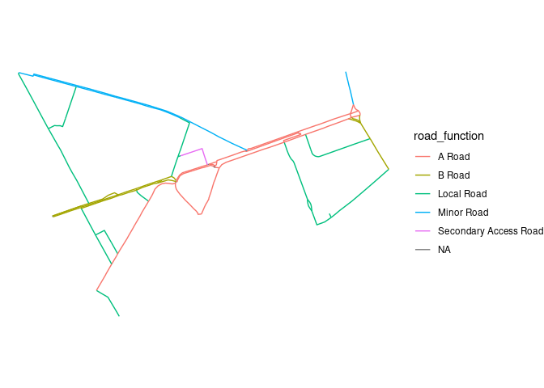

# Testing network joining functions
Robin Lovelace

# Introduction

Joining data is key to data science, allowing value to be added to
disparate datasets by combining them.

There are various types of join, including based on shared ‘key’ values
and shared space for spatial joins. However, neither of these join types
works for joining network data of the type shown below, which represents
2 separate networks with different but related geometries (source: [ATIP
browse
tool](https://acteng.github.io/atip/browse.html?style=streets#13.32/53.79562/-1.6874)).


Imagine you want to know what kind of cycle infrastructure is associated
with each segment of the MRN. That’s the kind of problem that network
joins can tackle.

This guide outlines the challenges of network joining and demonstrates
implementation-agnostic solutions.

It’s based on previous work:

- The networkmerge project (and related
  [parenx](https://github.com/anisotropi4/parenx) Python package
  available on pip): <https://nptscot.github.io/networkmerge/>

- An approach in JavaScript at
  <https://github.com/acteng/amat/tree/main/pct_lcwip_join>, described
  at <https://github.com/acteng/amat/blob/main/js/model.md#pct-join>

- The rnetmatch approach, which has been implemented in Rust with a
  nascent R wrapper (there are plans for a Python wrapper)

  - See text for paper at
    <https://github.com/nptscot/rnetmatch/blob/main/paper.qmd>
  - See description of the algorithm implemented in Rust here:
    <https://github.com/nptscot/rnetmatch/blob/main/rust/README.md>

We’ll use data from the Propensity to Cycle Tool and the
[OpenRoads](https://osdatahub.os.uk/downloads/open/OpenRoads) dataset as
an example.

# Example dataset

Datasets were take from a few case study areas.

We’ll focus on Thornbury, West Yorkshire for now.


# Subsetting the target ‘x’ network (optional)

A first step, to speed-up the join and reduce the size of the data, can
be to keep only the records in the target ‘x’ dataset that are relevant.
After this filtering step, the datasets look like this:


Of the four options, the third (with a distance of 20) looks like the
best compromise between omitting unwanted links while retaining the
majority of the network.

The most appropriate distance depends on your data and use case, it may
be worth keeping more of the ‘x’ network than you need and using the
join to filter out unwanted links (the subsetting stage is not
essential).

# Basic spatial join

A simple approach to joining the two networks is with a simple spatial
join, using one of the available ‘binary predicates’, such as
`st_intersects`, `st_within` (relevant for buffers), `st_contains` or
`st_touches`.

The results when the `flow` attributes are summed are shown below:


Unfortunately the results are way out: the total flow in the joined
network using this basic join approach is less than half (48 %) the
total flow in the original network.

# The rnet_merge approach

The `rnet_join` and `rnet_merge()` functions in {stplanr}were developed
to address this issue. Code to undertake the join are shown below.

``` r
rnet_joined_1 = stplanr::rnet_join(net_x_subset_20, net_y, dist = 15)
rnet_joined_2 = stplanr::rnet_join(net_x_subset_20, net_y, dist = 15, segment_length = 10)
```

The results are based on ‘flat headed’ buffers around the x geometry,
with results kept in this form in the output, as shown in the table and
figure below.

| id                                   | flow | length_y |
|:-------------------------------------|-----:|---------:|
| 0306E7A4-C705-4776-A357-CA58B64396FA |    0 | 9.832566 |
| 0306E7A4-C705-4776-A357-CA58B64396FA |    0 | 9.832566 |
| 030E661F-4DAE-470F-807C-52B69BE295B3 |    3 | 9.464192 |


The plot shows big differences in the results of the `rnet_join()`
function depending on the `segment_length` parameter, which splits `y`
links into segments of the specified length, before doing the join to
the buffer.

Let’s aggregate the results and re-join to the geometries of `x`, this
time using the lengths of `x` and `y` to ensure more important values
are given more weight, and see if the results are more accurate.

The total flow on the networks are 8 % and 97 % of the total flow in the
original network, respectively.

<!-- The results are shown below: -->


The results above show that the `rnet_join()` function works well,
capturing the majority of the flow in the `y` network, with the
`segment_length` parameter allowing the user to control the level of
detail in the output. Users have full control over the aggregating
functions used, which can be useful for different use cases, e.g. to
classify the highway type, as shown in the code snippet below, which
demonstrates the function’s ability to work in either direction (x and y
can be swapped).

``` r
net_y = sf::read_sf("data/open_roads_thornbury.gpkg") |>
  transmute(road_function = road_function)
net_x = sf::read_sf("data/pct_thornbury.gpkg") |>
  transmute(id = 1:n())
net_x = stplanr::rnet_subset(net_x, net_y, dist = 20)
net_y_split = stplanr::line_segment(net_y, segment_length = 10, use_rsgeo = FALSE)
rnet_joined = stplanr::rnet_join(net_x, net_y_split, segment_length = 0)
rnet_joined_values = rnet_joined |>
  sf::st_drop_geometry() |>
  group_by(id) |>
  summarise(
    categories = paste0(unique(road_function), collapse = ",")
    )
rnet_joined_x = left_join(net_x, rnet_joined_values, by = "id")
# rnet_joined_x |>
#   ggplot() +
#   geom_sf(aes(fill = categories), colour = NA) +
#   theme_void()
rnet_joined_x |>
  select(categories) |>
  ggplot() +
  geom_sf(aes(colour = categories)) +
  theme_void()
```


